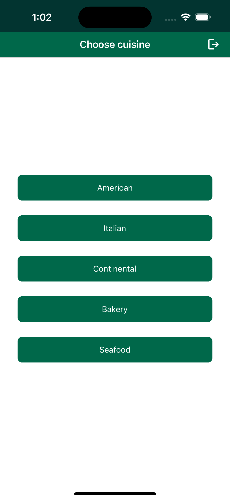
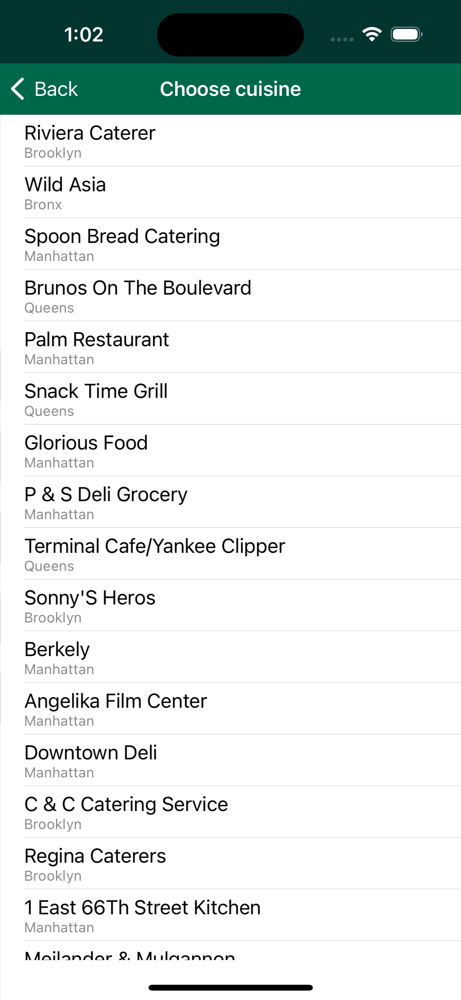

# IntelligentCache

**IntelligentCache** is a sample MAUI application that shows how it is possible to use Atlas as an intelligent cache against an external service. Having Atlas sitting between the clients and the external service allows to reduce unnecessary requests to the external service, and greatly simplifies synchronization of data to the client by using [Atlas Device Sync](https://www.mongodb.com/docs/atlas/app-services/sync/). With this approach, the client does not request data directly from the external service, but just creates `Requests` objects that are then synchronized and handled by Atlas using [Database Triggers]((https://www.mongodb.com/docs/atlas/app-services/triggers/database-triggers/#create-a-database-trigger)), similar to what has been shown in the [ObjectsAsAPI](../ObjectsAsAPI/) example project. 
For example, Atlas can:
- Recognise duplicate or overlapping requests;
- Keep track of the "freshness" of data and avoid requesting data too often to the external service;
- Implement automatic refresh logic of the data at specific intervals;
- Synchronize relevant data to clients with Device Sync;

In this app we are going to show a simple example of this approach. The app allows the user to retrieve a list of restaurants depending on the desired cuisine type. For simplicity, we're going to use the [sample restaurants dataset](https://www.mongodb.com/docs/atlas/sample-data/sample-restaurants/#std-label-sample-restaurants) (that contains various information about New York restaurants) and the [Data API](https://www.mongodb.com/docs/atlas/app-services/data-api/) to simulate an external REST service that Atlas is interfacing to. In a later section we are going to see how we can reduce how often Atlas needs to request data to the external service.

## Prerequisites

Developing .NET MAUI apps requires Visual Studio 2022 17.3 or greater, or Visual Studio 2022 for Mac 17.4 or greater. You also need to install the MAUI workload for the platform you are interested into. You can do this either through the Visual Studio UI or with the command line.

To install the workload with the command line:
- List all the available workloads with `dotnet workload search`
- Install a workload with `dotnet workload install *workloadName*`. 

For instance, if you're interested in the workload for all available platforms you can just do `dotnet workload install maui`. 

Once the workload is installed Visual Studio should ask you to install additional components if needed when the solution is opened. You can find additional information about how to install MAUI and support for specific platforms in the [official documentation](https://learn.microsoft.com/en-us/dotnet/maui/get-started/installation?tabs=vswin).

## Configuration

In order to run the example project you need to:
- Create an App in [MongoDB Atlas](https://www.mongodb.com/docs/atlas/app-services/sync/get-started/) and change the `_appId` variable in `RealmService` to the ID of the application you have created.
- Enable [Email/Password Authentication](https://www.mongodb.com/docs/atlas/app-services/authentication/email-password/). 
- Load sample data following the instructions in the [documentation](https://www.mongodb.com/docs/atlas/sample-data/).

Then, you can either import the App configuration (recommended) in this repo or configure the app manually.

### Import the App configuration

To import the app configuration in this repository you will need to:
- Set your App ID in [realm_config.json](AtlasApp/realm_config.json)
- Set your cluster name in [config_json](AtlasApp/data_sources/mongodb-atlas/config.json)
- Add a App Service User following the [documentation](https://www.mongodb.com/docs/atlas/app-services/users/create/#manually-create-an-email-password-user) and set `run_as_user_id` in [data_api_config.json](AtlasApp/http_endpoints/data_api_config.json) using the id of the user you've just created.
- Install `realm-cli` and generate an API key following the [documentation](https://www.mongodb.com/docs/atlas/app-services/cli/#mongodb-binary-bin.realm-cli).

    `npm install -g mongodb-realm-cli`

- Login to the realm-cli:

    `realm-cli login --api-key="<my api key>" --private-api-key="<my private api key>"`

- Go into the app folder:

    `cd AtlasApp`

- Deploy the app to Atlas App Services:

    `realm-cli push --yes`

-  Fill `baseDataApiPath` in the `RestaurantsRequestHandler` function, the base path for the Data API that you can [find in the UI](https://www.mongodb.com/docs/atlas/app-services/data-api/generated-endpoints/#base-url). 

### Configure the App manually

To configure the app manually you will need to:
- Enable [Device Sync](https://www.mongodb.com/docs/atlas/app-services/sync/get-started/).
- Enable [Development Mode](https://www.mongodb.com/docs/atlas/app-services/sync/configure/sync-settings/) using `restaurantsDb` as the database name.
- Add a App Service User following the [documentation](https://www.mongodb.com/docs/atlas/app-services/users/create/#manually-create-an-email-password-user).
- Setup the [Data API](https://www.mongodb.com/docs/atlas/app-services/data-api/generated-endpoints/#set-up-the-data-api) for the HTTP endpoint we're going to use. Specify `User Id` as the authentication option, and use the user you've created in the previous step.
- Create the [Function](https://www.mongodb.com/docs/atlas/app-services/functions/#define-a-function) `RestaurantsRequestHandler`, using the code in [RestaurantsRequestHandler.js](AtlasApp/functions/RestaurantsRequestHandler.js). Remember to fill `baseDataApiPath`, the base path for the Data API you've configured in the previous step.
- Create the [Database Trigger](https://www.mongodb.com/docs/atlas/app-services/triggers/database-triggers/#create-a-database-trigger) `RestaurantsRequestTrigger`, with operation type "Insert" on the collection named `restaurantsRequests`, and selecting the `RestaurantsRequestHandler` function you have created in the previous step.


## Application functionality

<p align="center">
    
    
</p>

The main page of the application allows the user to select the kind of cuisine they are interested into. After selection, the user is brought to another page that shows the available restaurants that serve that cuisine type, together with the borough in which they are located. 

## The API

Comparably to the [ObjectsAsAPI](../ObjectsAsAPI/) example, we are using the synchronization of Realm objects, that we call "requests", similarly to an API call to Atlas when combined with Database Triggers. 

First of all, let us take a look at the `RestaurantRequest` class:

```csharp
[MapTo("restaurantsRequests")]
public partial class RestaurantsRequest : IAsymmetricObject
{
    [PrimaryKey]
    [MapTo("_id")]
    public ObjectId Id { get; private set; }

    [MapTo("cuisine")]
    public string Cuisine { get; private set; }

    [MapTo("timestamp")]
    public DateTimeOffset Timestamp { get; private set; }

    public RestaurantsRequest(CuisineType cuisine)
    {
        Id = ObjectId.GenerateNewId();
        Cuisine = cuisine.ToString();
        Timestamp = DateTimeOffset.Now;
    }
}
```

The request is defined as an `IAsymmetricObject` as we only require to unidirectionally sync the request objects to Atlas, and we do not need to modify them after creation. You can see more information about unidirectional data ingest in the [documentation](https://www.mongodb.com/docs/realm/sdk/dotnet/sync/asymmetric-sync/).

The `RestaurantRequest` is created and added to Realm when the app moves to the restaurants page. The request contains the cuisine type the user is interested into, as well as the timestamp of the request. The idea here is that when those requests are synced, a trigger on the backend can process them, and eventually request data from the external service and add it to the Atlas database. In this case the trigger function avoids requesting data again to the external service if the last restaurant requests happened less than 10 minutes. The information about the last time a certain cuisine was requested is kept in the `requestsInfo` collection, that acts like a [key-value store](https://www.mongodb.com/databases/key-value-database), where the key is the cuisine type, and the value is the timestamp of the last request. 

This is a very simple logic, but could be expanded to accommodate various needs. To understand how is this implemented, let us take a look at the trigger function:

```js
const serviceName = "mongodb-atlas";
const databaseName = "restaurantsDb";
const restaurantsCollectionName = "restaurants";
const requestsCollectionName = "requestsInfo";

// Add base path for Data API
const baseDataApiPath = "";

exports = async function(changeEvent){
  
  if(baseDataApiPath.length === 0) {
    throw Error("Remember to add your own base path for Data API!")
  }
  
  // changeEvent.fullDocument is the body of the RestaurantsRequest that was synchronized
  const cuisine = changeEvent.fullDocument.cuisine;
  const requestTimestamp = changeEvent.fullDocument.timestamp;

  const db = context.services.get(serviceName).db(databaseName);
  const restaurantsCollection = db.collection(restaurantsCollectionName);
  const requestsCollection = db.collection(requestsCollectionName);
  
  // Check if we already requested the same data earlier
  const info = await requestsCollection.findOne({"cuisine": cuisine});
  
  if (info != null) {
    const minutesDifference = (requestTimestamp - info.lastRequestTimestamp) / (1000*60);
    if(minutesDifference < 10) {
      // We requested the data less than 10 minutes ago, nothing to do
      return;
    }
  }
  
  // Retrieve restaurants from API
  const parsedResult = await fetchRestaurantsFromAPI(cuisine);
  
  // Add retrieved data to Atlas
  const bulkWriteOperation = parsedResult.map( doc => ({
    updateOne: {
      filter: { _id: new BSON.ObjectId(doc._id) },
      update: { $set: {
        _id: new BSON.ObjectId(doc._id),
        name: doc.name,
        borough: doc.borough,
        cuisine: cuisine,
      }},
      upsert: true //Insert if not already present
    },
  }));
  
  await restaurantsCollection.bulkWrite(bulkWriteOperation, {ordered: false});
  
  // Update request info collection with last request timestamp
  const newInfo = {
    "cuisine": cuisine,
    "lastRequestTimestamp": new Date()
  }
  
  await requestsCollection.updateOne(
    {"cuisine": cuisine}, //Filter
    { "$set":  newInfo},
    { "upsert": true } //Insert if not already present
    )
};
```

When the function is run, the flow is as follows:
- We check if we have a record for the requested cuisine in the `requestsInfo` collection. If we do, and less than 10 minutes have passed since the previous request, we just do nothing and return.
- Otherwise, we fetch the restaurants with `fetchRestaurantsFromAPI`. This function is making a request against the [Data API](https://www.mongodb.com/docs/atlas/app-services/data-api/) endpoints, to simulate an external service. The body of the function is not shown here, as how to use the Data API is not relevant to this example, and could be exchanged for a call to any other kind of external service.
- Afterwards, the restaurants information retrieved from the service are parsed and added to the `restaurants` collection. 
- Finally, the `requestsInfo` collection is updated with the new timestamp of the latest request (`lastRequestTimestamp`).

