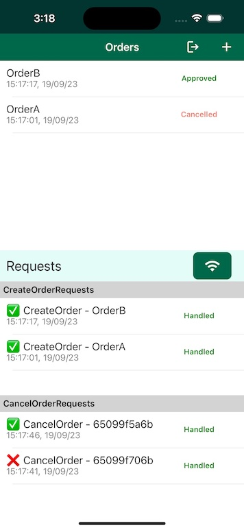

# ObjectsAsAPI

**ObjectsAsAPI** is a sample MAUI application that shows how to it is possible to use the insertion or update of Realm objects as a way to simulate a backend API call once the objects are synchronized on Atlas. In practice, this example shows how is it possible to create specific Realm objects representing API calls (**objects-as-api**), and how it is possible to use [Database Triggers]((https://www.mongodb.com/docs/atlas/app-services/triggers/database-triggers/#create-a-database-trigger)) to handle such calls. 

For this example application, let us imagine the use case of a repairman that works on ships, where it cannot be guaranteed a stable internet connection. The repairman needs to create orders of all the pieces he needs for his repairs as he goes through the ship. In a later section we will take a look at how the app is structured to handle API calls all within Realm and Atlas Device Sync.

## Prerequisites

Developing .NET MAUI apps requires Visual Studio 2022 17.3 or greater, or Visual Studio 2022 for Mac 17.4 or greater. You also need to install the MAUI workload for the platform you are interested into. You can do this either through the Visual Studio UI or with the command line.

To install the workload with the command line:
- List all the available workloads with `dotnet workload search`
- Install a workload with `dotnet workload install *workloadName*`. 

For instance, if you're interested in the workload for all available platforms you can just do `dotnet workload install maui`. 

Once the workload is installed Visual Studio should ask you to install additional components if needed when the solution is opened. You can find additional information about how to install MAUI and support for specific platforms in the [official documentation](https://learn.microsoft.com/en-us/dotnet/maui/get-started/installation?tabs=vswin).

## Configuration

In order to run the example project you need to first create an App in [MongoDB Atlas](https://www.mongodb.com/docs/atlas/app-services/sync/get-started/) and change the `_appId` variable in `RealmService` to the ID of the application you have created. Then, you can either configure the app manually, or import the App configuration in this repo.

### Import the App configuration

To import the app configuration in this repository you will need to:
- Set your App ID in [realm_config.json](AtlasApp/realm_config.json)
- Set your cluster name in [config_json](AtlasApp/data_sources/mongodb-atlas/config.json)
- Install `realm-cli` and generate an API key following the [documentation](https://www.mongodb.com/docs/atlas/app-services/cli/#mongodb-binary-bin.realm-cli).

    `npm install -g mongodb-realm-cli`

- Login to the realm-cli:

    `realm-cli login --api-key="<my api key>" --private-api-key="<my private api key>"`

- Go into the app folder:

    `cd AtlasApp`

- Deploy the app to Atlas App Services:

    `realm-cli push --yes`

### Configure the App manually

To configure the app manually you will need to:
- Enable [Device Sync](https://www.mongodb.com/docs/atlas/app-services/sync/get-started/).
- Enable [Development Mode](https://www.mongodb.com/docs/atlas/app-services/sync/configure/sync-settings/).
- Enable [Email/Password Authentication](https://www.mongodb.com/docs/atlas/app-services/authentication/email-password/).
- Create two [Functions](https://www.mongodb.com/docs/atlas/app-services/functions/#define-a-function):
    - `CreateOrderRequestHandler`, using the code in [CreateOrderRequestHandler.js](AtlasApp/functions/CreateOrderRequestHandler.js)
    - `CancelOrderRequestHandler`, using the code in [CancelOrderRequestHandler.js](AtlasApp/functions/CancelOrderRequestHandler.js)
- Create two [Database Triggers](https://www.mongodb.com/docs/atlas/app-services/triggers/database-triggers/#create-a-database-trigger):
    - `CreateOrderRequestTrigger`, with operation type "Insert" and "Update" on the collection name `CreateOrderRequest` with "Full Document" checked, and selecting the `CreateOrderRequestHandler` function you have created in the previous step;
    - `CancelOrderRequestTrigger`, with operation type "Insert" and "Update" on the collection name `CancelOrderRequest` with "Full Document" checked, and selecting the `CancelOrderRequestHandler` function you have created in the previous step;


## Application functionality

<p align="center">
    
</p>

The application allows the user to create orders, containing an arbitrary number of items, and possibly cancel them. The main screen of the app (shown in the screenshot) contains the list of the orders on the top part of the screen, while at the bottom it shows the *API Requests* that are used to create or cancel an order. The page contains also a button that allows you to stop and resume synchronization, to simulate the lack of internet connection.

Clicking on the "+" button allows you to create a new order, while clicking on an order will show its state, and allows to cancel it. Clicking on a request, instead, allows to see its state, and eventually cancel the request itself. For simplicity, it's also possible to swipe on all objects and delete them.

## The API

In this application we want to show how the synchronization of Realm objects can be treated as an API call when combined with Database Triggers.
For this, we have created `Request` objects, that represent the equivalent of an API call. 

To create a uniform shape for all the request objects, we have created the common interface `IRequest`:

```csharp
public interface IRequest<P, R>
    where P: IPayload
    where R: IResponse
{
    public ObjectId Id { get; set; }

    public string CreatorId { get; set; }

    public RequestStatus Status { get; set; }

    public DateTimeOffset CreatedAt { get; set; }

    public P? Payload { get; set; }

    public R? Response { get; set; }
}

public interface IPayload
{
}

public interface IResponse
{
    public ResponseStatus Status { get; }

    // Filled if Status == Rejected
    public string? RejectedReason { get; }
}

public enum RequestStatus
{
    Draft, // The user is still editing, it shouldn't be handled
    Pending, // User confirmed, waiting for backend
    Handled, // Response created
}

public enum ResponseStatus
{
    Approved,
    Rejected,
}
```

The request objects have 3 main fields:
- `Payload`, representing the body of the request;
- `Response`, representing the response to the request, created by the backend after handling. The response has a `Status` property, that indicates if the request has been approved or rejected, and eventually the reason.
- `Status`, indicating the status of the request: "Draft" is used when the request is still being edited on the client side; "Pending" is used when the request is ready for the backend to be picked up; "Handled" is set by the backend after the request has been handled and the response has been filled. 

The main idea here is that once a request is added or modified, then a trigger on the backend can be run in order to simulate an API call and implement the correspondent business logic. For this simple application there are two requests that have been implemented, `CreateOrderRequest` and `CancelOrderRequest`, respectively to create and cancel an order.

Let us take a look a how `CreateOrderRequest` looks like and how it is handled, as an example. First of all, the model:

```csharp
public partial class CreateOrderRequest 
    : IRealmObject, IRequest<CreateOrderPayload, CreateOrderResponse>
{
    [PrimaryKey]
    [MapTo("_id")]
    public ObjectId Id { get; set; } = ObjectId.GenerateNewId();

    [MapTo("_creatorId")]
    public string CreatorId { get; set; }

    [MapTo("status")]
    private string _Status { get; set; } = null!;

    public RequestStatus Status
    {
        get => Enum.Parse<RequestStatus>(_Status);
        set => _Status = value.ToString();
    }

    [MapTo("createdAt")]
    public DateTimeOffset CreatedAt { get; set; }

    [MapTo("payload")]
    public CreateOrderPayload? Payload { get; set; }

    [MapTo("response")]
    public CreateOrderResponse? Response { get; set; }
}

public partial class CreateOrderPayload : IEmbeddedObject, IPayload
{
    [MapTo("content")]
    public OrderContent? Content { get; set; }
}

public partial class CreateOrderResponse : IEmbeddedObject, IResponse
{
    [MapTo("order")]
    public Order? Order { get; private set; }

    [MapTo("status")]
    private string _Status { get; set; } = null!;

    public ResponseStatus Status
    {
        get => Enum.Parse<ResponseStatus>(_Status);
        private set => _Status = value.ToString();
    }

    [MapTo("rejectedReason")]
    public string? RejectedReason { get; private set; }
}
```

There are a couple of things to notice here:
- Both the `Payload` and `Response` are two embedded objects that are specific to this request.
- `CreateOrderPayload` contains the content of the order the client would like to create.
- `CreateOrderResponse` contains the backend answer to the request. If the request has been approved (`Status == Approved`), then a new `Order` will be created, otherwise (`Status == Rejected`) there will be the reason in `RejectedReason`.

Once this object gets created/modified and synchronized, then the `CreateOrderRequestTrigger` will be run, that will invoke the `CreateOrderRequestHandler` function: 

```js

const orderCollectionName = "Order";
const requestCollectionName = "CreateOrderRequest";

const serviceName = "mongodb-atlas";
const databaseName = "ObjectsDatabase";

exports = async function(changeEvent) {
  try {
    var fullDoc = changeEvent.fullDocument;

    if (fullDoc.status !== "Pending") {
      return;
    }
    
    const requestId = changeEvent.documentKey._id;
    const db = context.services.get(serviceName).db(databaseName);
    
    const payload = fullDoc.payload;
    const creatorId = fullDoc._creatorId;

    var response;

    if(payload.content.items == undefined) {
      response = {
        "status": "Rejected",
        "rejectedReason": "There are no items in this order!"
      }
    } else {
      const orderCollection = db.collection(orderCollectionName);
      
      const order = {
        "_id" : new BSON.ObjectId(),
        "_creatorId" : creatorId,
        "status": "Approved",
        "content": payload.content,
      };
      
      const orderId = (await orderCollection.insertOne(order)).insertedId;
      
      const orderRef = {
        $ref: orderCollectionName,
        $id: orderId,
        $db: databaseName,
      };
      
      response = {
        "order": orderRef,
        "status": "Approved",
      }
  }
      
    const requestCollection = db.collection(requestCollectionName);
    const update = { 
      "$set": {
        "status" : "Handled",
        "response": response 
      }
    }
    
    await requestCollection.updateOne({"_id": requestId}, update);
    
  } catch(err) {
    console.log("error while creating response: ", err.message);
  }
};
```

When the function gets run, the flow is as follows:
- If the status of the `CreateOrderRequest` is not `Pending`, then we don't do anything.
- Then, if there are no items in the order content (`payload.content.items == undefined`), we create a response, sets its status to `Rejected` and and specify the reason.
- Otherwise we create an order, and add it to a response with its status set to `Approved`.
- Finally, we update the request, by setting its status to `Handled` and adding the response we just created. 

This function is quite simple, but could contain any kind of business logic related to the application. 

