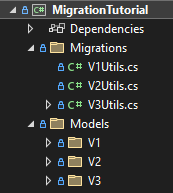
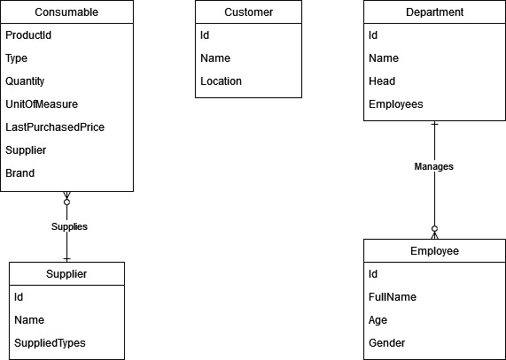
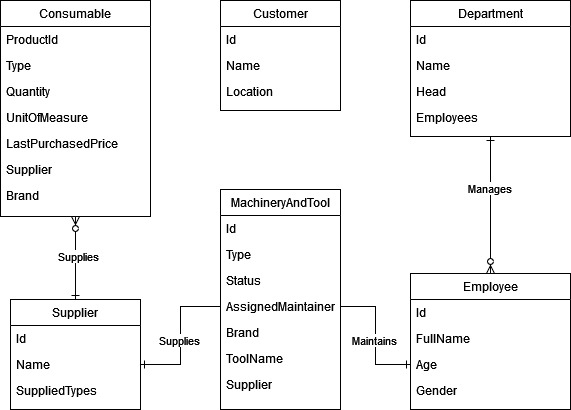

# Performing a real world schema migration in Realm
## Introduction
When dealing with databases, schema migration is a common operation that takes place during development. However, the shift toward an agile mindset has made schema migrations not an uncommon operation to be performed on production code. Since data loss in deployed applications is detrimental to a business to various degrees, today we take a look at how to perform real world schema migrations in Realm so that you can do your best when the time comes.

In order for me to show you how to perform a schema migration, I first need to set the stage so to make the code closer to what any of you may actually have to deal with. Let us think about a small company involved in shoes manufacturing that want to keep track of the business in a digital manner. Initially, they do not need to keep track of many things, mostly supplies and the few employees who work for them. However, since the business is doing good, they manage to secure some funding for expansion. At this point, more information needs to be stored on the company's IT system to have more transparency with their investors.  
The changes that arise from the various expansions of the company translate in schema migrations. In this blog-post I have simulated 3 different rounds of changes, which translate in 2 different migration functions.  

Before we start with the deep dive, you should know that the extracts of code that you are going to see in this blog-post can be found in our [example repo](https://link.to.the.repo). The project uses [preprocessor directives](https://docs.microsoft.com/en-us/dotnet/csharp/language-reference/preprocessor-directives) to drive the various migrations; more on this later. But suffice to say that in order to see the full flow of the schema migrations you must define the *symbol* `SCHEMA_VERSION_1`, then build the project and, finally, run the resulting **dll**. Then, define `SCHEMA_VERSION_2`, rebuild and rerun the compiled binary. And as the last migration step, define `SCHEMA_VERSION_3` and redo the, already mentioned, build and run. A more in-depth guide on how to run the project can be found in [`MigrationTutorial/README.md`](https://link.to.the.repo/MigrationTutorial/README.md).

### Schema migrations in Realm
When reading this blog-post, it is assumed that you know what a schema migration is. However, just to reiterate it very briefly, a database uses a schema to formally define how its models are structured. Those models, generally, represent rather closely the view of the world from the business' perspective. Because a business isn't static, models may change over time. These changes could be in the form of modifications, deletions, additions and merges on both fields of a model and models themselves. A schema migration is what allows to migrate the previous schema to the new one.  
When Realm is opened, like any other database, it must make sure that the schema of the objects that it manages is equal to the schema that it is supplied with. If that is not the case and `RealmConfiguration.SchemaVersion` has not been monotonically bumped up a `Realms.Exceptions.RealmMigrationNeededException` is raised. If `RealmConfiguration.SchemaVersion` has been incremented, then the migration function is called.  
So two are the things that you need to do when you want to execute a schema migration in Realm:

1. monotonically bump up the `RealmConfiguration.SchemaVersion`
2. write a migration function with the following signature  
   ```cs
   public delegate void MigrationCallbackDelegate(Migration migration, ulong oldSchemaVersion);
   ```
   and assign it to `RealmConfiguration.MigrationCallback`.  

Since mistakes made during migration, that is in `RealmConfiguration.MigrationCallback`, can result in data loss; it is very important to understand all the details surrounding the matter. Hence, this blog-post delves deep on how to write a `RealmConfiguration.MigrationCallback`.

If you want to read more about the subject you could start by reading our [introduction](https://www.mongodb.com/docs/realm/sdk/dotnet/fundamentals/schema-versions-and-migrations/) and [documentation](https://www.mongodb.com/docs/realm/sdk/dotnet/examples/modify-an-object-schema/#migration-functions) on schemas and migrations.

## Code Overview
In order to help you browsing faster through the [code](https://link.to.the.repo) of this tutorial I will briefly go over the structure of the project.

When the application starts for the first time, `Program.Main`[(1)](#1-main) initialises the realm *1)* and then seeds[^fn1] it *2)*.

</br>

---
#### (1) Main
```cs
class Program
{
    static int Main()
    {
        try
        {
            RealmService.Init(); // 1)
            SeedData.Seed(); // 2)
            return 0;
        }
        catch (Exception e)
        {
            Logger.LogError($"Exception {e} was encountered.");
            return 1;
        }
    }
}
```

---

</br>

Initialisation[(2)](#2-initialisation-of-the-realm) is executed by `RealmService.Init`. This part of the process prepares the `RealmConfiguration` where we set the name of the database *3)*, assign the, properly bumped up, schema version *4)* and the migration callback *5)*. On top of these steps, the initialisation function takes also care of deleting the realm when it realises that the user is starting over from a previous run *8)*.

</br>

---
#### *(2) Initialisation of the realm*
```cs
public class RealmService
{
    private static ulong _schemaVersion = 0;

    private static RealmConfiguration _realmConfiguration;

    public static Realm GetRealm() => Realm.GetInstance(_realmConfiguration);

    public static void Init()
    {
        if (_schemaVersion == 0)
        {
#if SCHEMA_VERSION_1
            _schemaVersion = 1;
#elif SCHEMA_VERSION_2
            _schemaVersion = 2;
#elif SCHEMA_VERSION_3
            _schemaVersion = 3;
#endif

            Logger.LogInfo($"Selected schema version: {_schemaVersion}");

            _realmConfiguration = new RealmConfiguration("migrationTutorial.realm") // 3)
            {
                SchemaVersion = _schemaVersion, // 4)

                MigrationCallback = (migration, oldSchemaVersion) => // 5)
                {
                    Logger.LogInfo("A migration has started");

#if SCHEMA_VERSION_2
                    Logger.LogInfo("The migration V2 is about to take place");
                    V2Utils.DoMigrate(migration, oldSchemaVersion); // 6)
#elif SCHEMA_VERSION_3
                    Logger.LogInfo("The migration V3 is about to take place");
                    V3Utils.DoMigrate(migration, oldSchemaVersion); // 7)
#endif
                }
            };

            var realmPath = _realmConfiguration.DatabasePath;
            if (File.Exists(realmPath) && _schemaVersion == 1) // 8)
            {
                Realm.DeleteRealm(_realmConfiguration);
            }
        }
        else
        {
            Logger.LogWarning($"You can't set the schema version more than once! It's currently set to {_schemaVersion}.");
        }
    }
}
```

---

</br>

I have left out the seeding code as that is not really interesting as it just adds data to the realm. Instead, we need to take a closer look at the models so that you can understand the steps of the migration functions that I show later on.

[^fn1]: Seeding in this context refers to the action of populating a database with some dummy data.

### Models and migration functions structure
All the models are defined in the `Models` folder and categorized under a subfolder named `V1` for the models of the schema version 1, a subfolder `V2` for the models of schema version 2 and so on. A similar approach is used for the migration and seeding functions that are defined under the `Migration` folder. Namely, `V1Utils` for the utilities needed for the schema version 1, `V2Utils` for those needed for the schema version 2 and so on.

</br>

img1) *Project Folder Hierarchy*



</br>

This tutorial wants to show how the models change and evolve throughout the history of the company. To make this possible the best way is to have snapshots of the models but at different points in time; what I have been calling V1, V2 and V3.  
However, this specific detail created an issue in the project: Realm finds multiple models with the same name, e.g. `V1.Consumable`, `V2.Consumable` etc.  
This problem is addressed by using [preprocessor directives](https://docs.microsoft.com/en-us/dotnet/csharp/language-reference/preprocessor-directives) to select the right models to be included in the compilation. This is something that should generally never be required in a real world application. The pattern looks like

</br>

---
#### *(3) Example of usage of preprocessor directives*
```cs
#if SCHEMA_VERSION_X

public class ClassThatCollides
{
    // .......
}

#endif
```

---

</br>

The same approach is used in any instance where there are collisions in the logic of the application. An example can be seen in the migration callback *5)* assigned during initialisation[(2)](#2-initialisation-of-the-realm) where the function selects which migration function, `V2Utils.DoMigrate` *6)* or `V3Utils.DoMigrate` *7)*, to include in the compiled assembly based on what version of the migration needs to be executed.  
Remember that a simple conditional branch would not work as the `preprocessor directive` completely excludes parts of code from the compilation, resulting in e.g. `ClassThatCollides` not existing in the compiled assembly if `SCHEMA_VERSION_X` was not defined when the compilation was launched.  
Lastly, it is important to remember that it is not granted that clients of an application update in a timely manner. This means that the migration function must be able to migrate the schema over multiple versions at once. Later in the tutorial, you can see how a migration function can deal with this issue.

## Models and Migrations
As already mentioned, the business needs of the company change with time and this is inevitably reflected in their database schema. This, in turn, translates to multiple rounds of migrations. This section goes in detail over such migrations in Realm.

### V1 Models - The beginning
At the beginning the company only stores information on `Employee`s[(5)](#5-model-v1employee) and of `Consumable`s[(4)](#4-model-v1consumable), mostly to know when to restock and to keep track of expenditures.  

</br>

---
#### *(4) Model V1.Consumable*
```cs
public class Consumable : RealmObject
{
    [PrimaryKey]
    public ObjectId Id { get; private set; } = ObjectId.GenerateNewId();

    public string ProductId { get; set; }

    public ConsumableType Type
    {
        get => Enum.Parse<ConsumableType>(_Type);
        set => _Type = value.ToString();
    }

    public int Quantity { get; set; } = 0;

    [Required]
    public string UnitOfMeasure {get; set;}

    public float Price { get; set; }

    [Required]
    private string _Type { get; set; } = string.Empty;

    public Consumable(string productId = "")
    {
        ProductId = productId;
    }

    private Consumable() { }
}

public enum ConsumableType
{
    Glue,
    SandPaper,
    Brush,
    GlueHolder,
    MaterialSheet
}
```

---

#### *(5) Model V1.Employee*
```cs
public class Employee : RealmObject
{
    [PrimaryKey]
    public ObjectId Id { get; private set; } = ObjectId.GenerateNewId();

    [Required]
    public string FullName { get; set; }

    [Required]
    public int? Age { get; set; }

    public string Gender { get; set; }
}
```

---

</br>

### V1 to V2

#### V2 Models

</br>

img2) *ER diagram of V2 Models*



</br>

While the company's developers continue refining their internal tool they realise that it is far easier to ensure the correctness of `Employee.Gender` if the field is backed by an `enum` instead of a `string` *10)*. Additionally, the company wants `Consumable`s to be identified by their `ProductId` instead of a randomly generated `Id` *11)*. This will avoid in the future that an employee adds and/or finds multiple entries in the system for the same `Consumable`.  
Then, `Consumable`s need to have a `Supplier` *13)* and the last purchased price stored *12)*. The last known price is going to be used as a reference for the next purchase. Because of the latter change, `Consumable.Price` is not well indicative any more, so `LastPurchasedPrice` is chosen as a replacement *12)*.  
More models are also added: `Department`[(8)](#8-model-v2department), `Customer`[(9)](#9-model-v2customer) and `Supplier`[(10)](#10-model-v2supplier).

</br>

---
#### *(6) Model V2.Employee*
```diff
public class Employee : RealmObject
{
    [PrimaryKey]
    public ObjectId Id { get; private set; } = ObjectId.GenerateNewId();

    [Required]
    public string FullName { get; set; }

    [Required]
    public int? Age { get; set; }

+   public Department Department { get; set; }  //9)

+   public Gender Gender        //10)
+   {
+       get => Enum.Parse<Gender>(_Gender);
+       set => _Gender = value.ToString();
+   }

-   public string Gender { get; set; }
+   private string _Gender { get; set; }
}

+public enum Gender
+{
+   Male,
+   Female,
+   Other
+}
 ```

 ---

#### *(7) Model V2.Consumable*
```diff
public class Consumable : RealmObject
{
    [PrimaryKey]
-   public ObjectId Id { get; private set; } = ObjectId.GenerateNewId();    //11)
-
-   public string ProductId { get; set; }
+   public string ProductId { get; private set; }

    public ConsumableType Type
    {
        get => Enum.Parse<ConsumableType>(_Type);
        set => _Type = value.ToString();
    }

    public int Quantity { get; set; } = 0;

    [Required]
    public string UnitOfMeasure { get; set; }

-   public float Price { get; set; }
+   public float LastPurchasedPrice { get; set; }   //12)

+   public Supplier Supplier { get; set; }  //13)

+   public string Brand { get; set; }

    [Required]
    private string _Type { get; set; } = string.Empty;

    public Consumable(string productId = "")
    {
        ProductId = productId;
    }

    private Consumable() { }
}
```
---

#### *(8) Model V2.Department*
```cs
public class Department : RealmObject
{
    [PrimaryKey]
    public ObjectId Id { get; private set; } = ObjectId.GenerateNewId();

    [Required]
    public string Name { get; set; }

    public Employee Head { get; set; }

    [Backlink(nameof(Employee.Department))]
    public IQueryable<Employee> Employees { get; }
}
```

---

#### *(9) Model V2.Customer*
```cs
public class Customer : RealmObject
{
    [PrimaryKey]
    public ObjectId Id { get; private set; } = ObjectId.GenerateNewId();

    [Required]
    public string Name { get; set; }

    public string Location { get; set; }
}
```

---

#### *(10) Model V2.Supplier*
```cs
public class Supplier : RealmObject
{
    [PrimaryKey]
    public ObjectId Id { get; private set; } = ObjectId.GenerateNewId();

    public string Name { get; set; }

    private ISet<string> _SuppliedTypes { get; }

    [Ignored]
    public ISet<ConsumableType> SuppliedTypes { get; } = new HashSet<ConsumableType>();

    public void AddConsumableTypes(ConsumableType[] consumables)
    {
        foreach (var consumable in consumables)
        {
            AddConsumableType(consumable);
        }
    }

    public void AddConsumableType(ConsumableType consumable)
    {
        _SuppliedTypes.Add(consumable.ToString());
        SuppliedTypes.Add(consumable);
    }

    public void RemoveConsumableTypes(ConsumableType[] consumables)
    {
        foreach (var consumable in consumables)
        {
            RemoveConsumableType(consumable);
        }
    }

    public void RemoveConsumableType(ConsumableType consumable)
    {
        _SuppliedTypes.Remove(consumable.ToString());
        SuppliedTypes.Remove(consumable);
    }
}
```

</br>

#### Migration function
Trying to access objects whose schema is not matching the current one any more is not allowed by Realm. However, in a migration function we want to port the old data to new format, so we still need a way to access the old data. Here is when the [`Realm.DynamicApi`](https://www.mongodb.com/docs/realm-sdks/dotnet/latest/reference/Realms.Realm.html#Realms_Realm_DynamicApi) comes to the rescue *15)*; in fact this is the tool that allows us to bypass the checks for correctness that Realm normally applies. Lastly, when in a migration function [`Migration.OldRealm`](https://docs.mongodb.com/realm-sdks/dotnet/latest/reference/Realms.Migration.html#Realms_Migration_OldRealm) is where to find the old realm, the one that holds data modeled after the old schema; while [`Migration.NewRealm`](https://www.mongodb.com/docs/realm-sdks/dotnet/latest/reference/Realms.Migration.html#Realms_Migration_NewRealm) is where the migrated data needs to be written to. With the theory out of the way, we can look at the migration function.  
When we got the new *15)* and the old employees *14)*, the latter through the `DynamicApi`, we can start iterating over them *16)* in order to fill the `Employee.Gender` with the appropriate `enum`. Additionally, we need to rename the `Price` property to `LastPurchasedPrice` *17)*.  
Lastly, from a theoretical stand point changing which field is the primary key only requires an update in the schema. However, since by definition a PK must not have duplicates, we need to make sure that there are not duplicates in the newly selected field `Consumable.ProductId` *18)*. In case the new PK has duplicates that are not removed before the `MigrationCallback` ends, Realm throws `Realms.Exceptions.RealmDuplicatePrimaryKeyValueException`.  
Note that a `Department` is also added to the `Employee` model *9)*. But since that schema addition does not need any special handling, there is nothing to do about it in the migration function. Of course, if the new field needed to be filled according to some logic, the migration function would be a good place to do it.  

To summarise, in this migration you are going to see how to:
1. change the backing value of a model's property (from a string to an enum) *16)*
1. rename a property of a model *17)*
1. move the Primary Key (PKs) from a model's property to another one and handle the deletion of duplicated PKs *18)*

</br>

---

#### *(11) V2 Migration function*
```cs
public static void DoMigrate(Migration migration, ulong oldSchemaVersion)
{
    var newEmployees = migration.NewRealm.All<Employee>(); // 14)
    var oldEmployees = migration.OldRealm.DynamicApi.All("Employee");   // 15)

    // 16) change Gender property from string to enum
    for (var i = 0; i < newEmployees.Count(); i++)
    {
        var newEmployee = newEmployees.ElementAt(i);
        var oldEmployee = oldEmployees.ElementAt(i);
        if (string.Equals(oldEmployee.Gender, "female", StringComparison.OrdinalIgnoreCase))
        {
            newEmployee.Gender = Gender.Female;
        }
        else if (string.Equals(oldEmployee.Gender, "male", StringComparison.OrdinalIgnoreCase))
        {
            newEmployee.Gender = Gender.Male;
        }
        else
        {
            newEmployee.Gender = Gender.Other;
        }
    }

    // 17) rename Consumable.Price to Consumable.LastPurchasedPrice
    migration.RenameProperty(nameof(Consumable), "Price", nameof(Consumable.LastPurchasedPrice));

    // 18) remove duplicated Consumable to accommodate ProductId to become the new primary key
    var newConsumables = migration.NewRealm.All<Consumable>();
    var distinctConsumableId = new HashSet<string>();
    var consumableToDelete = new List<Consumable>();

    for (var i = 0; i < newConsumables.Count(); i++)
    {
        var currConsumable = newConsumables.ElementAt(i);

        // remove duplicates since ProductId is the new PrimaryKey
        if (distinctConsumableId.Contains(currConsumable.ProductId))
        {
            consumableToDelete.Add(currConsumable);
        }
        else
        {
            distinctConsumableId.Add(currConsumable.ProductId);
        }
    }

    consumableToDelete.ForEach(x => migration.NewRealm.Remove(x));
}
```

---

</br>

### V2 to V3

#### V3 Models

</br>

img3) *ER diagram of V3 Models*



</br>

After some time, given that the company keeps expanding, a new `Department` called `Workshop` is introduced. This `Department` is now in charge of maintaining `MachineryAndTool`s [(12)](#12-model-v3machineryandtool). Because of this addition the company reclassifies two `Consumable`s, `Brush` *19)* and `GlueHolder` *20)*, as `MachineryAndTool` since it is more environmentally friendly and economically advantageous to properly care for them. 

</br>

---

#### *(12) Model V3.MachineryAndTool*
```cs
public class MachineryAndTool : RealmObject
 {
    [PrimaryKey]
    public ObjectId Id { get; private set; } = ObjectId.GenerateNewId();

    private string _Type { get; set; }

    public Type Type
    {
        get => Enum.Parse<Type>(_Type);
        set => _Type = value.ToString();
    }

    private string _Status { get; set; }

    public OperationalStatus Status
    {
        get => Enum.Parse<OperationalStatus>(_Status);
        set => _Status = value.ToString();
    }

    public Employee AssignedMaintainer { get; set; }

    public string Brand { get; set; }

    public string ToolName { get; set; }

    public Supplier Supplier { get; set; }
}
```

---

#### *(13) Model V3.ConsumableTypes*
```diff
public enum ConsumableType
{
    Glue,
    SandPaper,
-   Brush,  // 19)
-   GlueHolder, // 20)
    MaterialSheet
}
```

---

</br>

#### Migration function
A new detail emerges in this migration function: checking against `oldSchemaVersion` *21)*. This is necessary because a migration must be able to be executed also when done from version X to version X+2 or higher. In our case from version 1 straight to 3. The content of the `if` branch *21)* is exactly the content of the migration from V1 to V2.  
After that, we take care of reclassifying `GlueHolder` *22)* and `Brush` *23)*. In order to do this we need to obtain the old `Consumable` of the needed type *24)*, extract all the fields that are relevant to `MachineryAndTool` *25)* and create a new instance of the latter class to be filled with the extracted data, where appropriate *26)*. When all of this is done, the new instance of `MachineryAndTool` is added to the new realm *26)* while the previous instance of `Consumable` is removed from the realm *27)*, given that its logical representation was moved to another class (`MachineryAndTool`).

To summarise, in this migration you are going to see how to:
1. enable the migration code to support jumps between schema versions greater than 1 *21)*
2. convert a model class into another *22)* *23)*

</br>

---
#### *(14) V3 Migration function*
```cs
public static void DoMigrate(Migration migration, ulong oldSchemaVersion)
{
    // 21) migration code from version 1
    if (oldSchemaVersion < 2)
    {
        var newEmployees = migration.NewRealm.All<Employee>();
        var oldEmployees = migration.OldRealm.DynamicApi.All("Employee");

        for (var i = 0; i < newEmployees.Count(); i++)
        {
            var newEmployee = newEmployees.ElementAt(i);
            var oldEmployee = oldEmployees.ElementAt(i);
            if (string.Equals(oldEmployee.Gender, "female", StringComparison.OrdinalIgnoreCase))
            {
                newEmployee.Gender = Gender.Female;
            }
            else if (string.Equals(oldEmployee.Gender, "male", StringComparison.OrdinalIgnoreCase))
            {
                newEmployee.Gender = Gender.Male;
            }
            else
            {
                newEmployee.Gender = Gender.Other;
            }
        }

        migration.RenameProperty(nameof(Consumable), "Price", nameof(Consumable.LastPurchasedPrice));

        var newConsumables = migration.NewRealm.All<Consumable>();
        var distinctConsumableId = new HashSet<string>();
        var consumableToDelete = new List<Consumable>();

        for (var i = 0; i < newConsumables.Count(); i++)
        {
            var currConsumable = newConsumables.ElementAt(i);

            // remove duplicates since ProductId is the new PrimaryKey
            if (distinctConsumableId.Contains(currConsumable.ProductId))
            {
                consumableToDelete.Add(currConsumable);
            }
            else
            {
                distinctConsumableId.Add(currConsumable.ProductId);
            }
        }

        consumableToDelete.ForEach(x => migration.NewRealm.Remove(x));
    }

    ConvertConsumableToTool(migration, oldSchemaVersion, "GlueHolder"); // 22)

    ConvertConsumableToTool(migration, oldSchemaVersion, "Brush");  // 23)
}

private static void ConvertConsumableToTool(Migration migration, ulong oldSchemaVersion, string consumableType)
{
    // it's assumed that there's always 1 and 1 only type of Consumable
    var oldConsumable = ((IQueryable<RealmObject>)migration.OldRealm.DynamicApi.All("Consumable")).Filter("_Type == $0", consumableType).FirstOrDefault();  // 24)
    if (oldConsumable == null)
    {
        Logger.LogWarning($"No consumable was found with type {consumableType}. Nothing to convert.");
        return;
    }

    Supplier consumableSupplier = null;
    string consumableBrand = string.Empty;

    // no suppliers if coming from schemaVersion 1
    if (oldSchemaVersion > 1)   // 25)
    {
        var supplierId = oldConsumable.DynamicApi.Get<RealmObject>("Supplier").DynamicApi.Get<ObjectId>("Id");
        consumableSupplier = migration.NewRealm.All<Supplier>().Filter("Id == $0", supplierId).FirstOrDefault();
        consumableBrand = oldConsumable.DynamicApi.Get<string>("Brand");
    }

    migration.NewRealm.Add(new MachineryAndTool()   // 26)
    {
        Type = Type.ManufacturingTool,
        Status = OperationalStatus.Functioning,
        AssignedMaintainer = null,
        ToolName = oldConsumable.DynamicApi.Get<string>("_Type"),
        Supplier = consumableSupplier,
        Brand = consumableBrand
    });

    var newConsumables = migration.NewRealm.All<Consumable>();

    var consumableProductId = oldConsumable.DynamicApi.Get<string>("ProductId");
    var consumableToRemove = newConsumables.Where(x => x.ProductId == consumableProductId).First();
    migration.NewRealm.Remove(consumableToRemove);  //27)
}
```

---

<br/>

## Conclusion
Schema migrations may sometimes be confusing. This blog-post wanted to help shedding more light on how to perform some common migrations in Realm. More specifically, it was shown how you could:

1. change the backing value of a model's property (from a string to an enum) *16)*
2. rename a property of a model *17)*
3. move the Primary Key (PKs) from a model's property to another one and handle the deletion of duplicated PKs *18)*
4. enable the migration code to support jumps between schema versions greater than 1 *21)*
5. convert a model class into another *22)* *23)*

We hope that this blog-post covers most of your doubts when it comes to migrations in Realm. However, we do plan to also show how to migrate `EmbeddedObjects`. That surely deserves a post of its own.